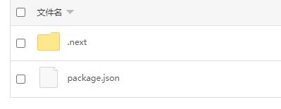
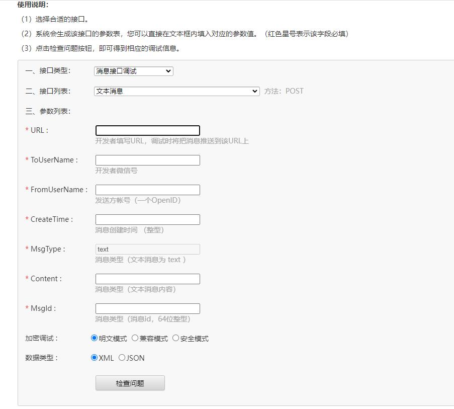

[中文](README.md) | [Italiano](README.IT.md)

# Quick Start

[](https://vercel.com/cyruszhou-cn/mp-wei-xin-chat-gpt/stores)   [](https://vercel.com/new/clone?repository-url=https%3A%2F%2Fgithub.com%2FCyrusZhou-CN%2FMP_WeiXin_ChatGPT&env=OPENAI_API_KEY&env=APP_ID&env=APP_SECRET&env=TOKEN&env=NEXTAUTH_URL&env=DB_TYPE&env=DB_HOST&env=DB_PORT&env=DB_USER&env=DB_PASS&env=DB_NAME&repository-name=MP_WeiXin_ChatGPT)  [](https://gitpod.io/#https://github.com/CyrusZhou-CN/MP_WeiXin_ChatGPT)

# Connecting WeChat Official Account to ChatGPT Program

This is a ChatGPT program that integrates with WeChat Official Account, which allows users to ask questions and get answers directly from ChatGPT through WeChat Official Account. It is based on Next.js framework.

## Configuration
1. Clone this repository to your local computer and enter the project directory.

   ```
   git clone https://github.com/CyrusZhou-CN/MP_WeiXin_ChatGPT.git
   cd MP_WeiXin_ChatGPT
   ```

2. Create a `.env` file in the root directory of the project.

3. Add the following configuration parameters in the `.env` file and replace them with actual parameter values:

   ```
   APP_ID=your_app_id
   APP_SECRET=your_app_secret
   TOKEN=your_token
   ENCODING_AES_KEY=(required for security mode)
   SUBSCRIBE_REPLY=Welcome to subscribe, feel free to ask ChatGPT any questions.
   CONTENT_TOO_LONG=The answer is too long and timed out. Please try again.
   OPENAI_API_KEY=your_openai_api_key
   OPENAI_MODEL=gpt-3.5-turbo
   OPENAI_TIMEOUT=60000
   IS_AUTHENTICATED=false
   NEXTAUTH_SECRET=(You can use the command openssl rand -base64 32 to generate a secret)
   NEXTAUTH_URL=http://localhost:3000/ (needs to be changed to the actual website address after deployment)
   MYSQL_HOST=localhost
   MYSQL_PORT=6306
   MYSQL_USER=weixin
   MYSQL_PASSWORD=weixin
   MYSQL_DATABASE=weixin
   VERCEL=false
   ```
   
4. Replace `your_app_id`, `your_app_secret`, `your_token`, `your_encoding_aes_key`, and `your_openai_api_key` with actual parameter values obtained from [WeChat Official Account Developer Platform](https://mp.weixin.qq.com/debug/cgi-bin/sandbox?t=sandbox/login) and [OpenAI API Key](https://platform.openai.com/account/api-keys).

   

   Note: In the WeChat Official Account management background, the URL is a complete address starting with your server address, such as http://yourdomain.com/api/wechat.

## Running Instructions
### Start MySQL Test Database Quickly
```
docker compose up -d 
```
### Debugging
1. Execute the following command in the root directory of the project to install dependencies.

   ```
   npm install
   ```
   
2. Verify the database
```
npm test  
```

3. Execute the following command to start the development server.

   ```
   npm run dev
   ```

4. In the WeChat Official Account management background, configure the server address, and fill in Token as the value of the `TOKEN` parameter in the configuration file.

5. Submit the configuration and enable the service.

6. Access WeChat Official Account to start testing the program.

## Database Configuration
Two tables are created in the database: `system_log` and `reply_cache`.

### The following fields are defined in the `system_log` table:
```
- `id`: Primary key, a unique identifier that auto-increments.

- `level`: Log level, supports values including 'error', 'warn', 'info', 'debug'.

- `message`: Log content.

- `createdAt`: Record creation time.

- `updatedAt`: Record update time.
```

### The following fields are defined in the `reply_cache` table:
```
- `id`: Primary key, a unique identifier that auto-increments.

- `msgId`: A unique identifier of the message, which acts as an identity identifier of the message in the WeChat Official Account.

- `responseId`: A random identifier associated with the answer.

- `input`: The user's question content.

- `reply`: ChatGPT's answer content.

- `ask`: int(11) NOT NULL Number of requests from WeChat Official Account.

- `createdAt`: Record creation time.

- `updatedAt`: Record update time.

- `expireAt`: Cache expiration time, used to control the validity period of the cache.
```
In the application, we use the `sequelize` module to operate the cache and save the cache to the `reply_cache` table.

The database file is located at db\mysql_init.sql

## Compilation and Release
1. Execute the following command in the root directory of the project to pack the application.

   ```
   npm run build
   ```

2. Upload the generated `.next` directory, `package.json`, and `.env` file to the server.

   

3. Execute the following command on the server to install dependencies.

   ```
   npm install
   ```

4. Execute the following command to start the application.

   ```
   npm start
   ```

5. In the WeChat Official Account management background, configure the server address, and fill in Token as the value of the `TOKEN` parameter in the configuration file.

6. Submit the configuration and enable the service.

7. Access WeChat Official Account to start using the program.

8. If you have any questions, you can debug them in the [WeChat Official Account Interface Debugging Tool](https://mp.weixin.qq.com/debug).

   

# PHP Request Proxy Program
If your server does not support external access to WeChat Official Account, you can use a PHP request proxy program to process the received requests and forward them to the Next.js application that supports the interface.

Follow these steps:

1. Copy the content of the `./php/proxy.php` file and create a new `proxy.php` file, and paste the content into it.

2. Replace `'https://*.vercel.app/api/wechat'` with the URL address of the Next.js application that you deployed in the previous step.

3. Upload the `proxy.php` file to the server that supports PHP services, and remember the URL address where the file is located.

4. In the WeChat Official Account management background, configure the service as the URL address of the PHP file.

If you are using Vercel, note that the default timeout period for functions in Vercel is 10 seconds, which can lead to errors when processing large amounts of text with ChatGPT. Therefore, it is recommended to deploy the application on your own server.

# Vercel PostgreSQL Database Instructions
As Vercel does not support SQLite, it offers a cloud-based PostgreSQL database service as an alternative solution.

Create a PostgreSQL database by clicking on the "Storage" tab after logging in to the Vercel dashboard.

Set Environment Variables.

The Vercel PostgreSQL connection configuration can be viewed in the ".env.local" tab of the database.

Corresponding settings for this project:
```
DB_TYPE=postgres
DB_HOST=POSTGRES_HOST
DB_PORT=5432
DB_USER=POSTGRES_USER
DB_PASS=POSTGRES_PASSWORD
DB_NAME=POSTGRES_DATABASE
```

# Backend management
Backend address: http://localhost:3000/admin

Username/password: admin/admin

GPT Chat Translation.