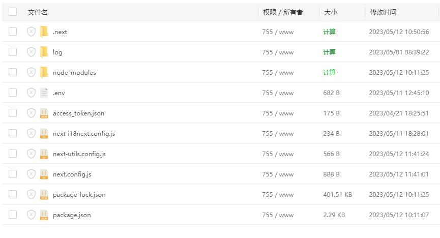

[中文](README.md) | [English](README.EN.md)


# Inizio rapido

[](https://vercel.com/cyruszhou-cn/mp-wei-xin-chat-gpt/stores)   [](https://vercel.com/new/clone?repository-url=https%3A%2F%2Fgithub.com%2FCyrusZhou-CN%2FMP_WeiXin_ChatGPT&env=OPENAI_API_KEY&env=APP_ID&env=APP_SECRET&env=TOKEN&env=NEXTAUTH_URL&env=DB_TYPE&env=DB_HOST&env=DB_PORT&env=DB_USER&env=DB_PASS&env=DB_NAME&repository-name=MP_WeiXin_ChatGPT)  [](https://gitpod.io/#https://github.com/CyrusZhou-CN/MP_WeiXin_ChatGPT)

# Collegamento dell'account pubblico WeChat al programma ChatGPT

Questo è un programma basato su Next.js che collega l'account pubblico WeChat al programma ChatGPT. Puoi fare domande direttamente a ChatGPT e ricevere risposte attraverso l'account pubblico WeChat.

## Configurazione
1. Clona il repository e accedi alla directory del progetto.

   ```
   git clone https://github.com/CyrusZhou-CN/MP_WeiXin_ChatGPT.git
   cd MP_WeiXin_ChatGPT
   ```

2. Crea un file `.env` nella directory principale del progetto.

3. Aggiungi i seguenti parametri di configurazione nel file `.env` e sostituiscili con i valori effettivi.

   ```
   APP_ID=your_app_id
   APP_SECRET=your_app_secret
   TOKEN=your_token
   ENCODING_AES_KEY=（necessario quando il modo sicuro è abilitato）
   SUBSCRIBE_REPLY=Benvenuti, potete fare domande direttamente a ChatGPT
   CONTENT_TOO_LONG=La risposta è troppo lunga e il tempo è scaduto. Per favore, riprova a fare la domanda
   OPENAI_API_KEY=your_openai_api_key
   OPENAI_MODEL=gpt-3.5-turbo
   OPENAI_TIMEOUT=60000
   IS_AUTHENTICATED=false
   SECRET_COOKIE_PASSWORD=(Puoi usare il comando openssl rand -hex 16 per generare un segreto)
   MYSQL_HOST=localhost
   MYSQL_PORT=6306
   MYSQL_USER=weixin
   MYSQL_PASSWORD=weixin
   MYSQL_DATABASE=weixin
   VERCEL=false
   ```

4. Sostituisci `your_app_id`,`your_app_secret`,`your_token`,`your_encoding_aes_key` e `your_openai_api_key` con i valori effettivi che hai ottenuto dalla [piattaforma per sviluppatori WeChat](https://mp.weixin.qq.com/debug/cgi-bin/sandbox?t=sandbox/login) e dalla chiave API di [OpenAI](https://platform.openai.com/account/api-keys).


   Nota: nell'interfaccia di gestione dell'account pubblico WeChat, l'URL è l'indirizzo completo che inizia con l'indirizzo del tuo server, ad esempio http://yourdomain.com/api/wechat

## Istruzioni per l'esecuzione
### Avvia un database di test MySQL
```
docker compose up -d 
```

### Debug dell'esecuzione del test
1. Nella directory principale del progetto, esegui il comando seguente per installare le dipendenze.

   ```
   npm install
   ```

2. Verifica il database mediante il comando
   ```
   npm test
   ```
   
3. Avvia il server di sviluppo mediante il comando seguente.

   ```
   npm run dev
   ```

4. Configura l'indirizzo del server nell'account pubblico WeChat, e inserisci il Token del file di configurazione come valore del parametro `TOKEN`.

5. Sottometti le impostazioni e attiva il servizio.

6. Accedi all'account pubblico WeChat e inizia a testare il programma.

## Configurazione del database
Sono state create due tabelle nel database: `system_log` e `reply_cache`.

### Nella tabella `system_log`, abbiamo definito i seguenti campi:
```
- `id`: ID univoco generato automaticamente dal sistema.

- `level`: il livello del log, che può essere 'error', 'warn', 'info', 'debug'.

- `message`: il messaggio del log.

- `createdAt`: il momento in cui il log è stato creato.

- `updatedAt`: il momento in cui il log è stato aggiornato.
```

### Nella tabella `reply_cache`, abbiamo definito i seguenti campi:
```
- `id`: ID univoco generato automaticamente dal sistema.

- `msgId`: l'ID del messaggio univoco che identifica il messaggio nell'account pubblico WeChat.

- `responseId`: l'ID della risposta associata.

- `input`: il contenuto della domanda dell'utente.

- `reply`: la risposta di ChatGPT.

- `ask` int(11) NOT NULL il numero di richieste di connessione all'account pubblico WeChat.

- `createdAt`: il momento in cui la risposta è stata creata.

- `updatedAt`: il momento in cui la risposta è stata aggiornata.

- `expireAt`: il tempo di scadenza della cache, che è utilizzato per controllare la validità della cache.
```

Nell'applicazione, utilizziamo il modulo `sequelize` per gestire la cache e salvarla nella tabella `reply_cache`.

Il file del database si trova in db \mysql_init.sql

## Compilazione e rilascio
1. Nella directory principale del progetto, esegui il seguente comando per compilare l'applicazione.

   ```
   npm run build
   ```

2. Carica la directory `.next` generata, il file `package.json` e il file `.env` sul server.

   

3. Sul server, esegui il seguente comando per installare le dipendenze.

   ```
   npm install
   ```

4. Sul server, esegui il seguente comando per avviare l'applicazione.

   ```
   npm start
   ```

5. Configura l'indirizzo del server nell'account pubblico WeChat, e inserisci il Token del file di configurazione come valore del parametro `TOKEN`. 

6. Sottometti le impostazioni e attiva il servizio.

7. Accedi all'account pubblico WeChat e inizia a utilizzare il programma.

8. Se riscontri problemi, utilizza lo strumento di debug dell'[account pubblico WeChat](https://mp.weixin.qq.com/debug).


# Programma proxy di richiesta PHP
Se il tuo server non supporta l'accesso esterno all'account pubblico WeChat, puoi utilizzare un programma proxy di richiesta PHP per inviare le richieste ricevute all'applicazione Next.js che supporta l'API.

Ecco come si usa:

1. Copia il contenuto del file `./php/proxy.php`, crea un nuovo file chiamato `proxy.php` e incolla il contenuto.

2. Sostituisci `'https://*.vercel.app/api/wechat'` con l'URL dell'applicazione Next.js che hai effettivamente distribuito come descritto sopra.

3. Carica il file `proxy.php` su un server che supporta il servizio PHP e annota l'URL in cui il file è stato caricato.

4. Nell'account pubblico WeChat, configura l'URL del servizio come URL di `proxy.php`.

Se usi Vercel, devi tenere a mente che il tempo di timeout predefinito per le funzioni di Vercel è di 10 secondi e, quando ChatGPT elabora un grande volume di testo, potrebbe richiedere più tempo e generare un errore, quindi è preferibile distribuire l'applicazione sul proprio server.

# Istruzioni per il database PostgreSQL di Vercel
Poiché Vercel non supporta SQLite, offre un servizio di database PostgreSQL basato su cloud come soluzione alternativa.

Crea un database PostgreSQL cliccando sulla scheda "Storage" dopo aver effettuato il login nel dashboard di Vercel.

Imposta le variabili d'ambiente.

La configurazione di connessione di PostgreSQL di Vercel può essere visualizzata nella scheda ".env.local" del database.

Impostazioni corrispondenti per questo progetto:
```
DB_TYPE=postgres
DB_HOST=POSTGRES_HOST
DB_PORT=5432
DB_USER=POSTGRES_USER
DB_PASS=POSTGRES_PASSWORD
DB_NAME=POSTGRES_DATABASE
```

# Gestione backend
Indirizzo di backend: http://localhost:3000/admin

Nome utente/password: admin/admin

Traduzione di Chat GPT.