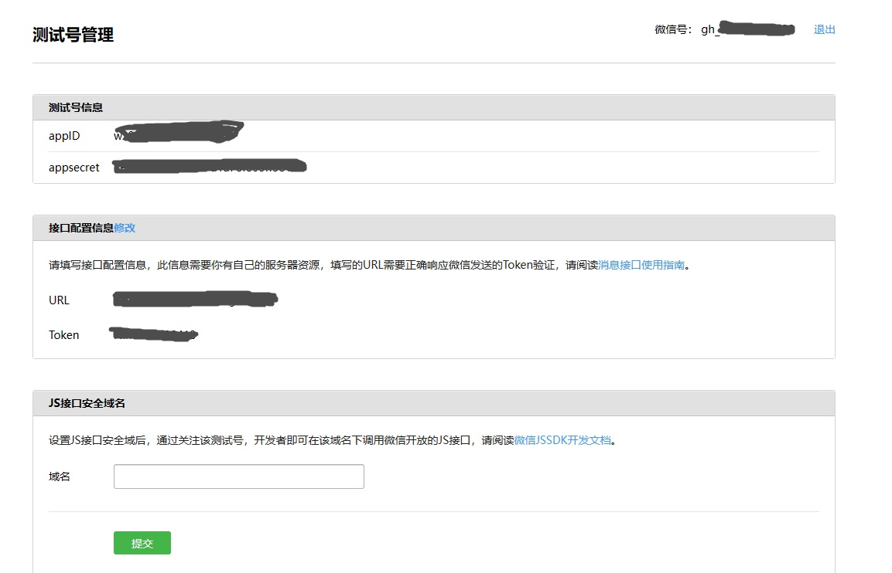

# 微信公众号对接ChatGPT程序

这是一个基于 Next.js 开发的微信公众号对接 ChatGPT 程序，可以通过微信公众号直接向 ChatGPT 提问并获取答案。

## 配置

1. 克隆本仓库到本地，并进入项目目录。

   ```
   git clone https://github.com/CyrusZhou-CN/MP_WeiXin_ChatGPT.git
   cd MP_WeiXin_ChatGPT
   ```

2. 在项目根目录创建一个 `.env` 文件。

3. 在 `.env` 文件中添加以下配置参数，并替换为实际的参数值。

   ```
   APP_ID=your_app_id
   APP_SECRET=your_app_secret
   TOKEN=your_token
   ENCODING_AES_KEY=your_encoding_aes_key （如果开启安全模式，则需要设置该参数）
   SUBSCRIBE_REPLY=欢迎关注，可直接向ChatGPT提问
   CONTENT_TOO_LONG=答案太长，超时了，请重新提问
   OPENAI_API_KEY=your_openai_api_key
   OPENAI_MODEL=gpt-3.5-turbo
   ```

4. 将以上配置参数中的 `your_app_id`、`your_app_secret`、`your_token`、`your_encoding_aes_key` 和 `your_openai_api_key` 分别替换为通过[公众号开发者平台](https://mp.weixin.qq.com/debug/cgi-bin/sandbox?t=sandbox/login)获取的实际参数值和。[OpenAI API Key](https://platform.openai.com/account/api-keys);

注意：在微信公众号管理后台中，URL 的地址是以您的服务器地址为开头的完整地址，如 http://yourdomain.com/api/wechat
## 调试运行

1. 在项目根目录执行以下命令，安装依赖包。

   ```
   npm install
   ```

2. 执行以下命令，启动开发服务器。

   ```
   npm run dev
   ```

3. 在微信公众号管理后台中配置服务器地址，并将 Token 填写为配置文件中的 `TOKEN` 参数值。

4. 提交配置并启用服务。

5. 访问微信公众号，开始测试程序。

## 编译发布

1. 在项目根目录执行以下命令，打包应用程序。

   ```
   npm run build
   ```

2. 将生成的 `.next` 目录和 `package.json` 文件上传到服务器。

3. 在服务器上执行以下命令，安装依赖包。

   ```
   npm install
   ```

4. 在服务器上执行以下命令，启动应用程序。

   ```
   npm start
   ```

5. 在微信公众号管理后台中配置服务器地址，并将 Token 填写为配置文件中的 `TOKEN` 参数值。

6. 提交配置并启用服务。

7. 访问微信公众号，开始使用程序。

8. 如果你的服务器不支持外部接入微信公众号，你可以使用 PHP 请求代理程序，将接收到的请求经过处理后转发到支持接口的 Next.js 应用程序中。

   使用方法如下：

   - 复制 `./php/proxy.php` 文件的内容，新建一个 `proxy.php` 文件，并将内容粘贴进去。

   - 将 `'https://*.vercel.app/api/wechat'` 替换为你在上述步骤中部署的 Next.js 应用程序的 URL 地址。

   - 将 `proxy.php` 文件上传到支持 PHP 服务的服务器中，并记住文件所在的 URL 地址。

   - 在微信公众号管理后台中将服务配置为该 PHP 文件的 URL 地址。

   如果你使用的是 Vercel，需要注意 Vercel 的函数默认超时时间是 10 秒，而 ChatGPT 处理大量文本时可能会需要更长的时间，因此容易出错正式环境不推荐使用。